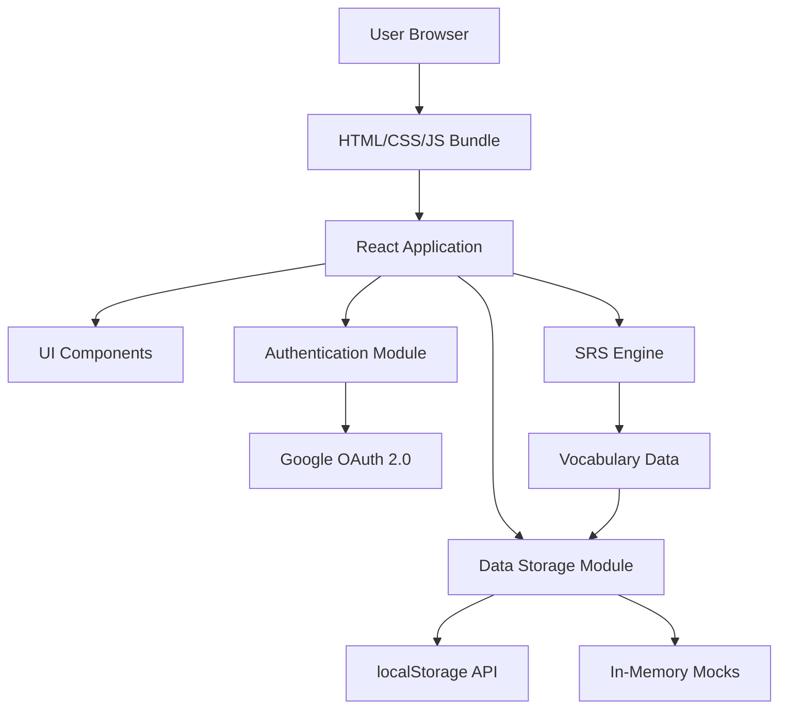
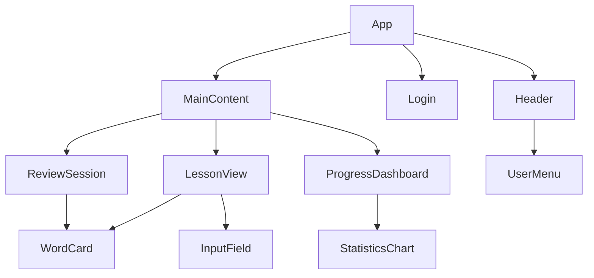
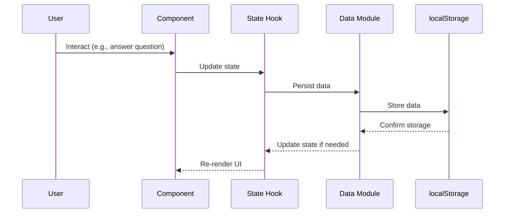

# Architecture and Design Plan for English to Vietnamese Learning Platform

## Overview

The English to Vietnamese Learning Platform is a client-side web application designed to facilitate language learning through Spaced Repetition System (SRS) and n+1 strategies. The platform focuses on building reading and writing skills by reviewing previously learned vocabulary and introducing new words incrementally. User authentication is implemented via Google OAuth 2.0 to enable personalized learning experiences and data synchronization. The application is built entirely on the frontend, with all backend functionalities mocked to allow for easy future integration with real services.

Key principles guiding the architecture:
- **SOLID Principles**: Ensuring maintainable, extensible, and testable code.
- **Modularity**: Backend/storage modules are designed for easy swapping between mocked and real implementations.
- **Client-Side Only**: No server-side dependencies for MVP, hosted on GitHub Pages.
- **CDN-Based Libraries**: No build process; all dependencies loaded via CDN.

## System Architecture

The application follows a traditional client-side architecture where all logic, data processing, and storage occur in the browser. React handles the UI rendering, while custom modules manage SRS logic, data persistence, and user interactions.

### High-Level Architecture Diagram



- **React Application**: Core framework for building the UI, using hooks for state management.
- **UI Components**: Modular React components following BEM CSS conventions.
- **SRS Engine**: Implements spaced repetition algorithms and n+1 strategy logic.
- **Data Storage Module**: Abstracts data persistence, currently using localStorage with interfaces for future backend integration.
- **Authentication Module**: Handles Google OAuth 2.0 flow for user login and session management.
- **Vocabulary Data**: Static or dynamically loaded word lists with translations and metadata.

## Components and Responsibilities

The application is structured as a tree of React components, each with single responsibilities adhering to SOLID principles.

### Component Hierarchy Diagram



- **App**: Root component, manages global state, authentication, and routing between views.
- **Header**: Displays app title, navigation, and user progress summary.
- **Login**: Handles Google OAuth authentication flow and user session management.
- **MainContent**: Container for the primary content area, switches between different views.
- **LessonView**: Presents new vocabulary in context, implements n+1 strategy.
- **ReviewSession**: SRS-based review interface for reinforcing learned words.
- **ProgressDashboard**: Visualizes user progress, streaks, and statistics.
- **WordCard**: Displays word, translation, and example usage.
- **InputField**: Handles user input for writing exercises.
- **StatisticsChart**: Renders progress data using simple charting libraries.
- **UserMenu**: Shows user info and logout option in the header.

Each component is designed to be reusable and testable, with clear props interfaces and minimal side effects.

## Data Management and State

State management is handled through React's built-in hooks (useState, useEffect) for component-level state, with a centralized data layer for persistence.

### Data Flow



- **State Hooks**: Manage component state and trigger re-renders.
- **Data Module**: Provides CRUD operations for vocabulary, progress, and user data.
- **Persistence**: Uses localStorage for client-side storage, with JSON serialization.
- **Mock Backend**: In-memory data structures simulate API responses for easy testing and future replacement.

Data structures include:
- Vocabulary items: { id, english, vietnamese, difficulty, examples }
- User progress: { wordId, easeFactor, interval, nextReview, correctCount }
- Session data: { currentLesson, reviewQueue, statistics }
- User profile: { id, email, name, avatar } (from Google OAuth)

Data is stored in localStorage keyed by user ID to enable multi-user support on shared devices. The Data Storage Module handles user-specific data isolation and provides interfaces for future cloud synchronization.

## SRS and n+1 Strategy Implementation

### Spaced Repetition System (SRS)

Implements a modified SM-2 algorithm for optimal memory retention:

1. **Initial Presentation**: Words introduced with default ease factor (2.5) and interval (1 day).
2. **Review Scheduling**: Interval increases based on performance (correct/incorrect responses).
3. **Ease Factor Adjustment**: Increases for correct answers, decreases for incorrect ones.
4. **Queue Management**: Maintains a review queue sorted by next review date.

### n+1 Strategy and Lesson System

- **Fixed Introduction Order**: Cards are introduced to all users in the same predetermined sequence to ensure consistent progression.
- **Daily Lessons**: New lessons become available every day at a configurable time (default: noon).
- **Cards Per Lesson**: Each lesson introduces a configurable number of new cards (default: 5).
- **Incremental Introduction**: Within a lesson, new cards are introduced one at a time as the user progresses.
- **Contextual Learning**: New cards presented with previously learned vocabulary.
- **SRS for Reviews**: Once introduced, card review scheduling follows individual user retention via SRS algorithm.
- **Lesson Limits**: Users can only introduce new cards during available lesson times, encouraging daily study habits.

### Implementation Details

- **SRS Engine Module**: Pure functions for calculating intervals and updating progress.
- **Lesson Generator**: Algorithm to select appropriate words for each session.
- **Performance Tracking**: Records response times and accuracy for adaptive difficulty.

## UI/UX Design Principles

The interface prioritizes simplicity, accessibility, and engagement to encourage daily use.

### Design Principles
- **Minimalist UI**: Clean, distraction-free interface focused on content.
- **Progressive Disclosure**: Information revealed as needed to avoid overwhelming users.
- **Responsive Design**: Adapts to different screen sizes for mobile and desktop use.
- **Accessibility**: WCAG compliant, with keyboard navigation and screen reader support.

### BEM CSS Structure

Follows BEM (Block Element Modifier) methodology for maintainable styles:

- **Blocks**: Independent components (e.g., `.card`, `.button`)
- **Elements**: Parts of blocks (e.g., `.card__title`, `.button__icon`)
- **Modifiers**: Variations (e.g., `.card--highlighted`, `.button--primary`)

Example structure:
```css
.card {
  /* Block styles */
}

.card__title {
  /* Element styles */
}

.card--featured {
  /* Modifier styles */
}
```

### Visual Hierarchy
- **Typography**: Clear font hierarchy with adequate contrast.
- **Color Scheme**: Calming blues and greens for learning environment.
- **Spacing**: Consistent margins and padding using a grid system.
- **Feedback**: Visual cues for correct/incorrect answers, progress indicators.

## Authentication

User authentication is implemented using Google OAuth 2.0 to provide secure, seamless login without requiring password management.

### Google OAuth 2.0 Implementation

- **Client-Side Flow**: Uses Google Identity Services (GIS) JavaScript library for authorization code flow with PKCE.
- **Scopes**: Requests basic profile information (email, name, avatar) via `openid profile email` scopes.
- **Token Handling**: ID tokens are validated client-side and used to establish user sessions.
- **Session Management**: User state is maintained in memory with automatic logout on token expiration.

### Security Considerations

- **No Sensitive Data Storage**: User credentials are never stored; only Google-provided ID tokens are handled.
- **HTTPS Requirement**: OAuth flow requires secure connections to prevent token interception.
- **Token Validation**: ID tokens are validated using Google's public keys to ensure authenticity.
- **Logout Handling**: Proper cleanup of user data and tokens on logout.

### User Experience

- **One-Click Login**: Single button initiates Google authentication flow.
- **Persistent Sessions**: Users remain logged in across browser sessions until explicit logout.
- **Profile Integration**: User avatar and name displayed in header for personalization.

## Deployment and Hosting

- **GitHub Pages**: Static hosting with automatic deployment from main branch.
- **CDN Dependencies**: React, Babel, Google Identity Services, and other libraries loaded from unpkg.
- **OAuth Configuration**: Requires Google Cloud Console setup with OAuth 2.0 client ID, authorized domains (GitHub Pages URL), and redirect URIs.
- **HTTPS Enforcement**: GitHub Pages automatically provides SSL certificates for secure OAuth flows.
- **No Build Process**: Files served directly, reducing complexity and maintenance.
- **Version Control**: Git for source control, with semantic versioning for releases.

## Future Extensibility

The modular architecture allows for easy expansion:

- **Backend Integration**: Replace mock modules with real API calls.
- **Additional Features**: Quizzes, audio pronunciation, community features.
- **Multi-Language Support**: Extend to other language pairs.
- **Advanced SRS**: Implement more sophisticated algorithms or user customization.
- **Analytics**: Add tracking for learning patterns and platform usage.

### Migration Path
1. Implement real backend API with same interfaces as mocks.
2. Extend Google authentication to support cloud storage and data synchronization.
3. Introduce collaborative features and social learning.
4. Scale to mobile apps using React Native or similar.

This architecture provides a solid foundation for an effective, scalable language learning platform while maintaining simplicity for the MVP.